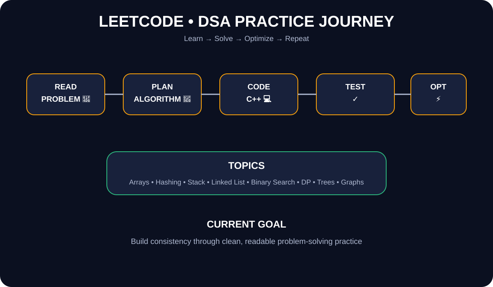

# 🚀 LeetCode Solutions

<div align="center">

### 🧩 DSA Practice • C++ • Problem Solving

**Learn → Solve → Optimize → Repeat 🔥**

</div>

---

## 👩‍💻 About This Repository

This repository tracks my ongoing **LeetCode and DSA learning journey**. Solutions are organized by problem and topic so the repo can grow into a clean revision and interview-practice reference.

- 🎓 BTech CSE student
- 💻 Practicing C++ & DSA
- 🧠 Strengthening algorithms and problem solving
- 🎯 Preparing for coding interviews through consistent practice

---

## 🎨 DSA Journey Visual

<p align="center">
  
</p>

> **Visual:** Read → plan → code → test → optimize.

---

## 📊 Progress

| Difficulty | Solved |
|---|---:|
| 🟢 Easy | 19 |
| 🟡 Medium | 0 |
| 🔴 Hard | 0 |
| **Total** | **19** |

> Progress changes as new solutions are added.

---

## 🧠 Topics

`Arrays` `Hash Table` `Strings` `Stack` `Two Pointers` `Binary Search` `Linked List` `Dynamic Programming` `Sorting` `Math`

---

## 📝 Problems Tracked

| # | Problem | Main Concept |
|---:|---|---|
| 1 | Two Sum | Hash Table |
| 9 | Palindrome Number | Math |
| 13 | Roman to Integer | Hash Table + String |
| 20 | Valid Parentheses | Stack |
| 53 | Maximum Subarray | Kadane's Algorithm |
| 70 | Climbing Stairs | Dynamic Programming |
| 88 | Merge Sorted Array | Two Pointers |
| 121 | Best Time to Buy and Sell Stock | Greedy |
| 125 | Valid Palindrome | Two Pointers |
| 141 | Linked List Cycle | Fast & Slow Pointers |
| 169 | Majority Element | Boyer-Moore Voting |
| 206 | Reverse Linked List | Linked List |
| 217 | Contains Duplicate | Hash Set |
| 242 | Valid Anagram | Frequency Counting |
| 283 | Move Zeroes | Two Pointers |
| 344 | Reverse String | Two Pointers |
| 347 | Top K Frequent Elements | Hash Map + Sorting |
| 349 | Intersection of Two Arrays | Hash Set |
| 387 | First Unique Character | Frequency Counting |
| 704 | Binary Search | Binary Search |

---

## 🗂️ Repository Structure

```text
leetcode---solutions/
├── Arrays/
├── Strings/
├── Linked-List/
├── Stack/
├── Binary-Search/
├── Dynamic-Programming/
├── 0013-roman-to-integer/
└── README.md
```

---

## 🗺️ DSA Roadmap

- [x] Arrays
- [x] Hash Table
- [x] Strings
- [x] Two Pointers
- [x] Stack
- [x] Linked List
- [x] Binary Search
- [x] Dynamic Programming
- [ ] Trees
- [ ] Graphs
- [ ] Advanced Dynamic Programming

---

## 🔥 Latest Practice Update — 29 September 2026

- 🏛️ Added and documented **Roman to Integer — LeetCode #13**.
- 📚 Added a complete problem explanation, approach, example walkthrough, C++ solution, and complexity analysis.
- 📊 Updated repository progress from **18 → 19 Easy problems**.
- 🧩 Added Roman to Integer to the main tracked-problems list.
- 🚀 Continuing consistent C++ and DSA practice.

### 📌 Current Practice Focus

```text
Arrays → Hashing → Strings → Two Pointers → Stack → Linked List → Binary Search → Trees → Graphs
```

---

<div align="center">

**🌱 Consistency > Speed**

⭐ Keep learning. Keep solving. Keep improving.

</div>

<!---LeetCode Topics Start-->
# LeetCode Topics
## Array
|  |
| ------- |
| [0004-median-of-two-sorted-arrays](https://github.com/sakshi01-art/leetcode---solutions/tree/master/0004-median-of-two-sorted-arrays) |
| [0014-longest-common-prefix](https://github.com/sakshi01-art/leetcode---solutions/tree/master/0014-longest-common-prefix) |
## Binary Search
|  |
| ------- |
| [0004-median-of-two-sorted-arrays](https://github.com/sakshi01-art/leetcode---solutions/tree/master/0004-median-of-two-sorted-arrays) |
## Divide and Conquer
|  |
| ------- |
| [0004-median-of-two-sorted-arrays](https://github.com/sakshi01-art/leetcode---solutions/tree/master/0004-median-of-two-sorted-arrays) |
## Math
|  |
| ------- |
| [0009-palindrome-number](https://github.com/sakshi01-art/leetcode---solutions/tree/master/0009-palindrome-number) |
| [0013-roman-to-integer](https://github.com/sakshi01-art/leetcode---solutions/tree/master/0013-roman-to-integer) |
## Hash Table
|  |
| ------- |
| [0013-roman-to-integer](https://github.com/sakshi01-art/leetcode---solutions/tree/master/0013-roman-to-integer) |
## String
|  |
| ------- |
| [0013-roman-to-integer](https://github.com/sakshi01-art/leetcode---solutions/tree/master/0013-roman-to-integer) |
| [0014-longest-common-prefix](https://github.com/sakshi01-art/leetcode---solutions/tree/master/0014-longest-common-prefix) |
| [0020-valid-parentheses](https://github.com/sakshi01-art/leetcode---solutions/tree/master/0020-valid-parentheses) |
## Trie
|  |
| ------- |
| [0014-longest-common-prefix](https://github.com/sakshi01-art/leetcode---solutions/tree/master/0014-longest-common-prefix) |
## Stack
|  |
| ------- |
| [0020-valid-parentheses](https://github.com/sakshi01-art/leetcode---solutions/tree/master/0020-valid-parentheses) |
## Bracket Sequences
|  |
| ------- |
| [0020-valid-parentheses](https://github.com/sakshi01-art/leetcode---solutions/tree/master/0020-valid-parentheses) |
<!---LeetCode Topics End-->

---

## 📌 Next Practice Targets

```text
Trees → Graphs → Dynamic Programming → Advanced DSA
```

**Practice cycle:** Understand → Plan → Code → Test → Analyze Complexity → Revise 🔁
